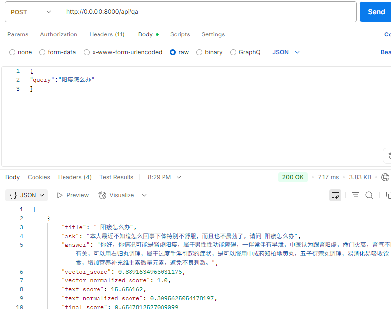

# QA问答系统
## 项目简介
基本混合检索的问答系统，为用户提供准确的医疗问题解答。系统使用FastAPI构建Web服务，支持异步处理请求，提高响应效率。





## 系统架构
系统主要由以下几个部分组成：

1. API服务层 ：使用FastAPI构建的Web服务，提供问答接口
2. 混合检索引擎 ：
   - 向量检索（FAISS）：基于语义相似度的检索
   - 文本检索（Elasticsearch）：基于关键词的检索
3. 嵌入模型 ：使用预训练的语言模型生成文本嵌入向量
4. 数据加载模块 ：负责加载和处理医疗问答数据集

## 工具
- 后端框架 ：FastAPI
- 向量检索 ：FAISS（支持CPU和GPU模式）
- 文本检索 ：Elasticsearch
## 安装与配置
### 环境要求
- Python 3.8+
- CUDA支持（可选，用于GPU加速）
- Elasticsearch服务

运行：
根据faiss_retriver.py和es_retriever.py的提示，处理数据
```python
python Retriver/es_retriver.py
python Retriver/faiss_retriver.py
```

```bash
python main.py